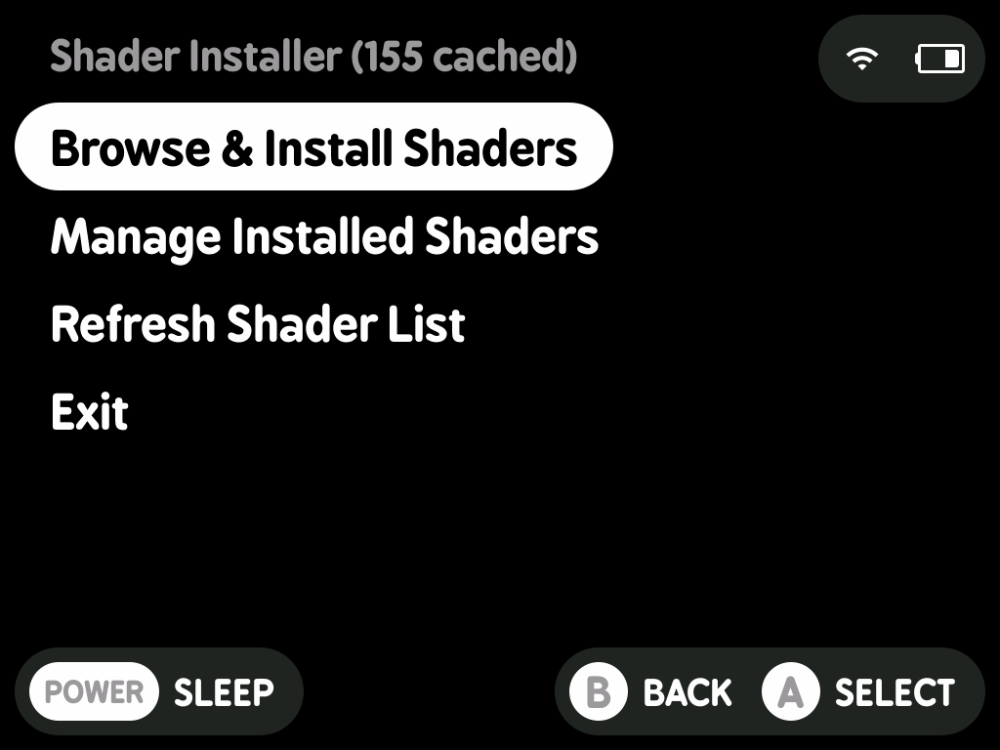
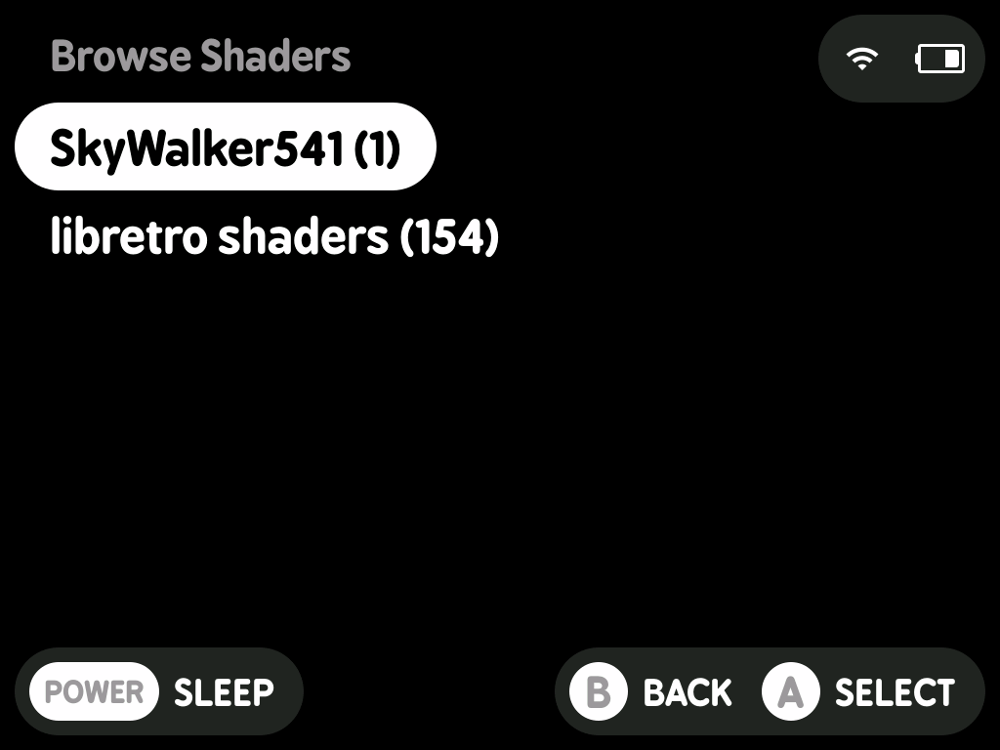
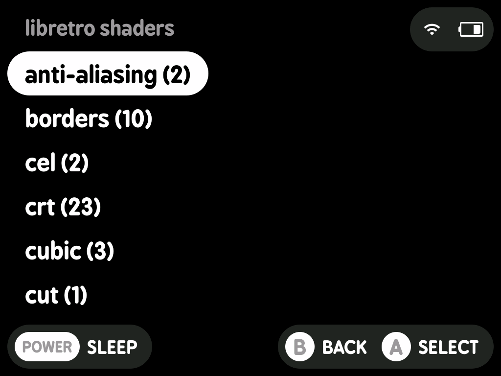

# NextUI Shader Installer Pak


Browse, download, and install single-pass GLSL shaders from GitHub directly onto your NextUI device. Shaders are automatically converted from RetroArch `.glslp` format to minarch-compatible `.cfg` files on install.

---

## Screenshots

<p>
  
  
  
</p>

---

## Features

- Browse shaders by source and category
- Single-pass shaders only
- Automatic `.glslp` → `.cfg` conversion with filter settings preserved
- Check for updates on installed shaders
- Delete installed shaders
- Shader list and commit dates cached after first run — subsequent launches are instant
- GitHub personal access token support for API rate limit bypass
- WiFi only required for cache build, refresh, and shader downloads

---

## Shader Sources

| Source | Description |
|---|---|
| **libretro/glsl-shaders** | The official libretro GLSL shader repository |
| **SkyWalker541/PT-SkyWalker541** | PT SkyWalker541 — a pixel transparency shader built for low-power devices |

---

## Installation

1. Download `Shader Installer.pak` from the releases page
2. Place the folder in the Tools folder for your device:
   ```
   /mnt/SDCARD/Tools/tg5040/   ← TrimUI Brick
   /mnt/SDCARD/Tools/tg5050/   ← TrimUI Smart Pro S
   /mnt/SDCARD/Tools/my355/    ← Miyoo A30 / Mini+
   ```
3. Eject SD card, insert into device, and launch **Shader Installer** from the Tools menu

---

## Usage

On first launch the shader list is built automatically. This fetches shaders and commit dates from GitHub and takes approximately 5-6 minutes. Subsequent launches open instantly from cache.

### Main Menu

- **Browse & Install Shaders** — navigate by source → category → shader, confirm to download and install
- **Manage Installed Shaders** — check for updates or delete installed shaders
- **Refresh Shader List** — re-fetches everything from GitHub, use when new shaders are released
- **Exit**

### Where Shaders Are Installed

```
/mnt/SDCARD/Shaders/
    ShaderName.cfg        ← minarch config
    glsl/
        ShaderName.glsl   ← shader source
```

Shaders are available in minarch's shader selector immediately after install.

---

## GitHub API Rate Limits

The cache build makes several hundred API requests to GitHub. Without a token, GitHub limits unauthenticated requests to 60 per hour. If this limit is reached during a cache build, the pak will notify you and display step-by-step instructions for setting up a free personal access token.

Most users will never encounter this. It is only likely if you refresh the cache multiple times in a short period.

### Setting Up a Token

If prompted by the pak, or to set one up in advance:

1. Go to [github.com](https://github.com) → **Settings** → **Developer settings**
2. Click **Personal access tokens** → **Tokens (classic)**
3. Click **Generate new token (classic)**
4. Give it a name, set an expiration, and **leave all scopes unchecked** — no permissions are needed
5. Generate the token and copy it
6. On your SD card, create a plain text file containing only your token:
   ```
   /mnt/SDCARD/.userdata/shared/Shader Installer/github_token.txt
   ```
7. Relaunch Shader Installer

With a token, the rate limit is raised to 5000 requests per hour.

---

## File Locations

| File | Location |
|---|---|
| Shader list cache | `/mnt/SDCARD/.userdata/shared/Shader Installer/cache/shader_list.txt` |
| Installed dates | `/mnt/SDCARD/.userdata/shared/Shader Installer/cache/installed/` |
| GitHub token | `/mnt/SDCARD/.userdata/shared/Shader Installer/github_token.txt` |
| Log file | `/mnt/SDCARD/Logs/Shader Installer.txt` |

---

## Changelog

### v1.0.0
- Initial release

---

## Credits

- Shader sources: [libretro/glsl-shaders](https://github.com/libretro/glsl-shaders) and [SkyWalker541/PT-SkyWalker541](https://github.com/SkyWalker541/PT-SkyWalker541)
- Built for [NextUI](https://github.com/LoveRetro/NextUI) by LoveRetro
- UI powered by [minui-list](https://github.com/josegonzalez/minui-list) and [minui-presenter](https://github.com/josegonzalez/minui-presenter) by josegonzalez
